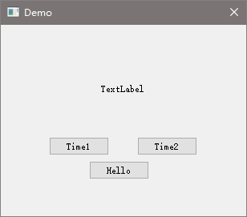

## My First GUI Project

- CMake的基本用法
- Qt的基本用法、信号槽机制(观察者模式)
- Qt的基本控件、布局、事件处理
- Qt的LGPL协议研究: 可以以闭源方式发布Qt应用(静态链接方式亦可，需要提供中间产品.obj文件的获取渠道以保障Qt库可以被替换) [Qt for Application Development](https://doc.qt.io/qt-5.15/qtappindev-licensing.html)
- Qt静态链接库的编译: 官方提供的SDK静态编译方式不可用，需要自行从源码编译
- MSVC的命令行编译方式， 64位系统用 "x64 Native Tools Command Prompt"， 32位系统用 "x86 Native Tools Command Prompt"。 注意不是 "Developer Command Prompt" / "Developer PowerShell"，后面这两个是x86，避免踩坑。

## ChatGPT聊天记录

https://shareg.pt/OegN52O

## 项目预览

